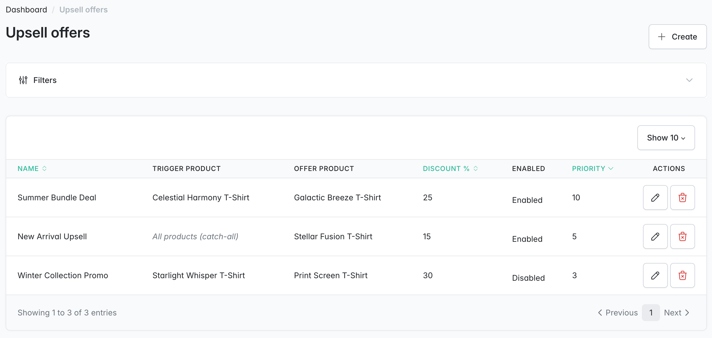
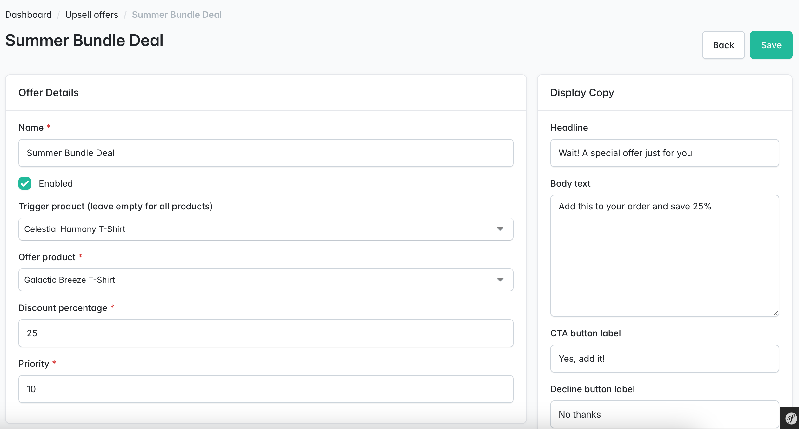
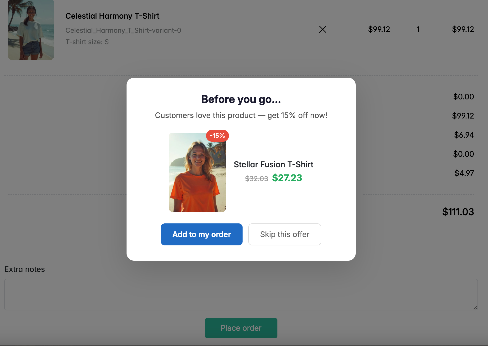

<p align="center">
    <a href="https://sylius.com" target="_blank">
        <picture>
            <source media="(prefers-color-scheme: dark)" srcset="https://media.sylius.com/sylius-logo-800-dark.png">
            <source media="(prefers-color-scheme: light)" srcset="https://media.sylius.com/sylius-logo-800.png">
            
        </picture>
    </a>
</p>

<h1 align="center">Sylius Upsell Plugin</h1>

<p align="center">
    Post-purchase upsell and cross-sell plugin for <a href="https://sylius.com">Sylius 2.x</a> stores — Frequently Bought Together, checkout upsell modals, and one-click add-all-to-cart.
</p>

<p align="center">
    <a href="https://github.com/abderrahimghazali/sylius-upsell-plugin/actions/workflows/ci.yaml"></a>
    <a href="https://packagist.org/packages/abderrahimghazali/sylius-upsell-plugin"></a>
    <a href="https://packagist.org/packages/abderrahimghazali/sylius-upsell-plugin"></a>
    <a href="LICENSE"></a>
    <a href="https://packagist.org/packages/abderrahimghazali/sylius-upsell-plugin"></a>
    <a href="https://packagist.org/packages/abderrahimghazali/sylius-upsell-plugin"></a>
    
</p>

---

## Screenshots

### Admin — Upsell Offers Grid


### Admin — Upsell Offer Form


### Shop — Checkout Upsell Modal


## Features

### Phase 1 — Frequently Bought Together (FBT)

- **Manual product relations** — link related products to any source product from the admin panel
- **Algorithmic fallback** — automatically suggests products based on co-purchase history when no manual relations exist
- **Configurable thresholds** — set the minimum co-purchase count before a suggestion appears
- **One-click add-all-to-cart** — shoppers can add the entire FBT bundle in a single click
- **Discount badges** — optional discount percentage displayed on related products
- **Customizable section title** — change the "Frequently bought together" heading from the admin
- **Twig hooks** — auto-injects into the product page, no template overrides needed

### Phase 2 — Checkout Upsell Modal

- **Post-purchase offers** — display a modal with a special offer after checkout completion
- **Trigger product targeting** — tie offers to specific products in the order
- **Variant-level offers** — optionally target a specific variant of the offer product
- **Discount percentage** — show a compelling discount on the upsell product
- **Custom copy** — configure headline, body, CTA label, and decline label per offer
- **Date scheduling** — set start and end dates for time-limited offers
- **Priority system** — control which offer is shown when multiple match
- **Enable/disable toggle** — activate or deactivate offers from the grid
- **No external JS** — pure vanilla JS via Stimulus controllers

## Requirements

- Sylius 2.1+
- Symfony 7.0+
- PHP 8.2+

## Installation

1. Require the plugin:

```bash
composer require abderrahimghazali/sylius-upsell-plugin
```

2. Register the bundle in `config/bundles.php` (if not auto-discovered):

```php
return [
    // ...
    Abderrahim\SyliusUpsellPlugin\SyliusUpsellPlugin::class => ['all' => true],
];
```

3. Import routes — create `config/routes/sylius_upsell.yaml`:

```yaml
sylius_upsell:
    resource: '@SyliusUpsellPlugin/config/routes.yaml'
```

4. Generate and run the migration:

```bash
bin/console doctrine:migrations:diff
bin/console doctrine:migrations:migrate
```

5. Register the Stimulus controllers in `assets/shop/controllers.json`:

```json
{
    "controllers": {
        "@abderrahimghazali/sylius-upsell-plugin": {
            "fbt": {
                "enabled": true,
                "fetch": "eager"
            },
            "post-purchase": {
                "enabled": true,
                "fetch": "eager"
            }
        }
    }
}
```

6. Symlink the plugin assets and rebuild:

```bash
# Create the symlink (from your project root)
mkdir -p node_modules/@abderrahimghazali
ln -s ../../vendor/abderrahimghazali/sylius-upsell-plugin/assets node_modules/@abderrahimghazali/sylius-upsell-plugin

# Rebuild assets
yarn encore dev
```

## Entity: UpsellRelation

| Field | Type | Description |
|-------|------|-------------|
| `sourceProduct` | ManyToOne (Product) | The product page where the FBT section appears |
| `relatedProduct` | ManyToOne (Product) | The product suggested alongside the source |
| `position` | int | Display order (lower = first) |
| `discount` | int? | Optional discount percentage for the related product |
| `createdAt` | datetime | Timestamp of creation |

## Entity: UpsellOffer

| Field | Type | Description |
|-------|------|-------------|
| `name` | string | Admin label for the offer |
| `enabled` | boolean | Active/inactive toggle |
| `triggerProduct` | ManyToOne (Product) | The purchased product that triggers this offer |
| `offerProduct` | ManyToOne (Product) | The product offered in the upsell modal |
| `offerVariant` | ManyToOne (ProductVariant)? | Optional specific variant to offer |
| `discountPercent` | int | Discount percentage shown in the modal |
| `headline` | string | Modal heading (default: "Wait! A special offer just for you") |
| `body` | text? | Optional body text |
| `ctaLabel` | string | Accept button text (default: "Yes, add it!") |
| `declineLabel` | string | Decline button text (default: "No thanks") |
| `priority` | int | Higher = shown first when multiple offers match |
| `startsAt` | datetime? | Optional start date |
| `endsAt` | datetime? | Optional end date |

## Entity: UpsellConfiguration

| Field | Type | Description |
|-------|------|-------------|
| `enabled` | boolean | Global FBT feature toggle |
| `minCoPurchaseThreshold` | int | Minimum co-purchase count for algorithmic suggestions (default: 3) |
| `maxProductsShown` | int | Maximum products in the FBT section (default: 4) |
| `sectionTitle` | string | Heading text (default: "Frequently bought together") |
| `showDiscountBadge` | boolean | Show/hide discount badges on FBT products |
| `fallbackStrategy` | string | `algorithmic`, `manual_only`, or `disabled` |

## Architecture

```
src/
├── Controller/
│   ├── Admin/
│   │   ├── UpsellConfigurationController.php    # Global FBT settings
│   │   └── UpsellOfferController.php            # CRUD for upsell offers
│   └── Shop/
│       └── PostPurchaseController.php           # Accept/decline offer API
├── DependencyInjection/
│   ├── Configuration.php
│   └── SyliusUpsellExtension.php                # Prepends resources, grids, hooks
├── Entity/
│   ├── UpsellConfiguration.php
│   ├── UpsellOffer.php
│   ├── UpsellOfferInterface.php
│   ├── UpsellRelation.php
│   └── UpsellRelationInterface.php
├── EventListener/
│   ├── AdminMenuListener.php                    # Marketing menu items
│   └── ProductFormListener.php                  # FBT tab on product form
├── Form/Type/
│   ├── ProductUpsellType.php                    # Product FBT relations form
│   ├── UpsellConfigurationType.php              # Global settings form
│   ├── UpsellOfferType.php                      # Upsell offer form
│   └── UpsellRelationType.php                   # Single relation row form
├── Repository/
│   ├── UpsellOfferRepository.php                # Active offers query
│   └── UpsellRelationRepository.php             # Relations by product
├── Service/
│   ├── FrequentlyBoughtTogetherResolver.php     # FBT logic (manual + algorithmic)
│   ├── PostPurchaseOfferResolver.php            # Best matching offer for an order
│   └── UpsellConfigurationProvider.php          # Cached config access
├── Twig/UpsellExtension.php                     # Twig function bridge
└── SyliusUpsellPlugin.php                       # Bundle class

assets/
├── controllers/
│   ├── fbt-controller.js                        # Add-all-to-cart Stimulus controller
│   └── post-purchase-controller.js              # Upsell modal Stimulus controller
└── package.json

templates/
├── Admin/
│   ├── configuration.html.twig                  # Global settings page
│   └── upsell_offer/
│       ├── create.html.twig
│       ├── update.html.twig
│       └── grid/field/product.html.twig
└── Shop/
    ├── frequently_bought_together.html.twig     # FBT section on product page
    └── post_purchase_offer.html.twig            # Upsell modal after checkout
```

## Testing

```bash
vendor/bin/phpunit
```

## License

MIT. See [LICENSE](LICENSE).
